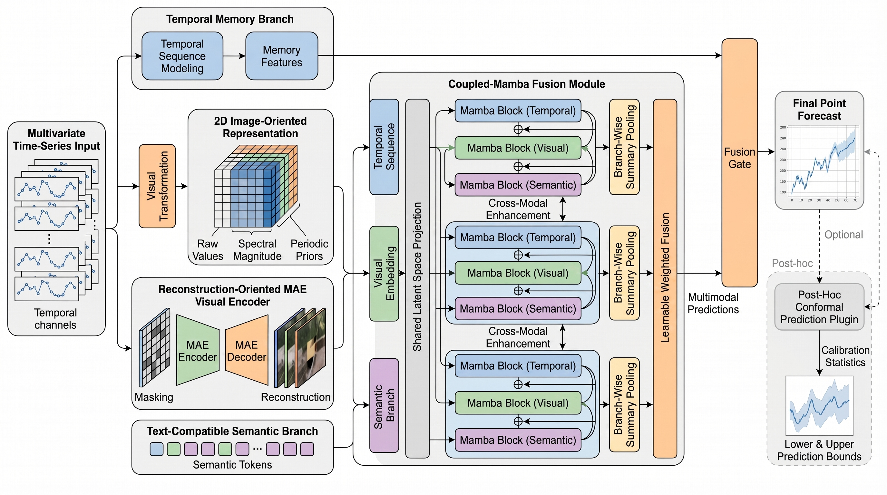

# Time-MaC

Time-MaC is a multimodal long-term time-series forecasting model that combines a temporal memory branch, reconstruction-conditioned visual features from a pretrained masked autoencoder (MAE), dataset-aware structured context, and enhanced Coupled-Mamba fusion.



## Main experimental configuration

The paper's main model uses one configuration across all seven datasets and four prediction horizons:

| Setting | Value |
|---|---:|
| Input length (`seq_len`) | 512 |
| Latent dimension (`d_model`) | 256 |
| Batch size | 6 |
| Maximum epochs | 20 |
| Learning rate | `1e-4` |
| Random seed | 0 |
| Visual branch | Pretrained reconstruction-oriented MAE |
| Fusion branch | Enhanced Coupled-Mamba enabled |
| Prediction horizons | 96, 192, 336, 720 |

`configs/config.py` uses these values as its defaults. The main benchmark script also passes every method-defining option explicitly so its behavior can be audited from the command itself.

## Structured context branch

The main model sends numeric context directly to the context pathway of
Coupled-Mamba instead of first rendering statistics as English text. It embeds
the identity of the seven supported datasets into 32 dimensions, concatenates
six normalized features (minimum, maximum, median, trend, look-back length, and
forecast horizon), and applies a `38 -> 128 -> 256` MLP. This branch has 38,240
trainable parameters and does not instantiate a tokenizer or language model.

The previous pretrained-language-encoder path remains available as an ablation
with `--context_encoder_type bert`. In that mode, the tracked descriptions in
`prompt_bank/` are combined with sample statistics and encoded by the configured
BERT checkpoint.

## Repository layout

```text
Time-MaC/
├── configs/                 # Model and command-line configuration
├── data_provider/           # Forecasting benchmark data loaders
├── docs/                    # Curated figures and documentation
├── exp/                     # Baseline experiment runners
├── layers/                  # Embedding, image-conversion, and MAE layers
├── models/                  # Time-MaC model and baseline models
├── prompt_bank/             # Dataset background text used by the text branch
├── scripts/                 # Main training and evaluation entry points
├── src/                     # Reconstruction MAE, VLM, and fusion components
├── utils/                   # Data, metrics, prompt, and evaluation utilities
├── run.py                   # Upstream-compatible baseline entry point
└── requirements.txt
```

Datasets, pretrained weights, checkpoints, logs, and generated result arrays are intentionally excluded from Git.

## Environment

Python 3.10 is recommended. Install the PyTorch build matching the system CUDA version before installing the remaining dependencies:

```bash
conda create -n time-mac python=3.10
conda activate time-mac

# Example only: select the PyTorch/CUDA build appropriate for your machine.
pip install torch torchvision --index-url https://download.pytorch.org/whl/cu121
pip install --no-build-isolation -r requirements.txt
```

The main experiment requires a CUDA-compatible `mamba-ssm` installation. The Transformer fallback in `src/coupled_mamba_fusion.py` is intended for interface checks, not for reproducing the reported Coupled-Mamba results.

## Data and pretrained assets

Place the seven public benchmark datasets as follows:

```text
dataset/
├── ETT-small/
│   ├── ETTh1.csv
│   ├── ETTh2.csv
│   ├── ETTm1.csv
│   └── ETTm2.csv
├── electricity/electricity.csv
├── weather/weather.csv
└── traffic/traffic.csv
```

ETT data are available from the official [ETDataset repository](https://github.com/zhouhaoyi/ETDataset). Electricity and Traffic follow the public multivariate benchmark data described in the [LSTNet data repository](https://github.com/laiguokun/multivariate-time-series-data).

Place the pretrained MAE-base checkpoint at:

```text
ckpt/mae_visualize_vit_base.pth
```

The default structured context branch has no external text checkpoint. For the
BERT ablation, the configured default is Google's pretrained BERT-Tiny checkpoint
`google/bert_uncased_L-2_H-128_A-2`, projected from 128 to 256 dimensions. Without
`--offline`, Transformers may retrieve it through the normal pretrained-model
mechanism; with `--offline`, it must already exist in the local cache.

## Reproduce the main table

Run all seven datasets at horizons 96, 192, 336, and 720:

```bash
bash scripts/run_public_benchmark_all.sh
```

The script uses the standard chronological ETT split for ETTh1, ETTh2, ETTm1, and ETTm2, and the standard 70/10/20 chronological custom-dataset split for Electricity, Weather, and Traffic. Normalization statistics are fit only on the training partition.

Each run writes:

- `run_config.json`: the complete resolved configuration, including seed and context-encoder settings;
- `training.log`: epoch-level training and validation records;
- `checkpoint_best.pth`: best-validation model, optimizer, scheduler, configuration, and model-size metadata;
- `results/final_metrics.json`: test MSE/MAE and the resolved configuration.

To run a single setting directly, use the same explicit model flags:

```bash
python scripts/train_time_me.py \
  --data ETTm2 \
  --root_path ./dataset/ETT-small \
  --save_path ./checkpoints/ettm2-p96 \
  --data_split ett_standard \
  --seq_len 512 \
  --pred_len 96 \
  --d_model 256 \
  --batch_size 6 \
  --epochs 20 \
  --learning_rate 1e-4 \
  --seed 0 \
  --vlm_type mae \
  --context_encoder_type structured \
  --dataset_embedding_dim 32 \
  --context_hidden_dim 128 \
  --context_output_dim 256 \
  --use_reconstruction_mae \
  --use_reconstruction_features \
  --use_enhanced_fusion \
  --mae_load_ckpt \
  --mae_ckpt_dir ./ckpt \
  --use_gpu --gpu 0
```

## Implementation map

- `models/time_me.py`: full Time-MaC forward path and context routing.
- `src/TimeVLM/structured_context.py`: dataset embedding and normalized numeric context MLP.
- `src/TimeVLM/mae_reconstruction_vlm.py`: pretrained MAE reconstruction features and optional BERT ablation.
- `src/coupled_mamba_fusion.py`: temporal, visual, and context pathways with cross-modal residual enhancement.
- `utils/prompt_bank.py`: deterministic dataset-to-prompt mapping for the BERT ablation.
- `utils/data_loader.py`: chronological split and train-only normalization logic.
- `scripts/train_time_me.py`: training, checkpointing, metrics, and configuration recording.

The repository retains baseline scaffolding and optional robustness/calibration utilities for analysis, but `scripts/run_public_benchmark_all.sh` is the canonical entry point for the paper's main model.
